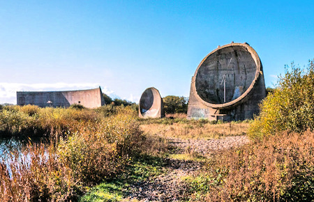
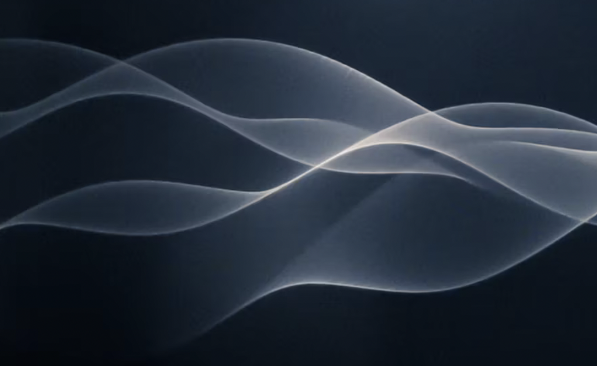
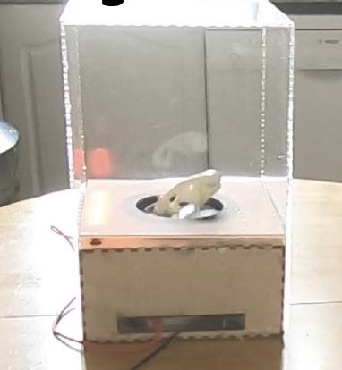

# The Art of Listening and Generative Sound Creation

## 1. Foundations of Sound

### The Science of Sound



*During the war we were good at listening*


- Life is made of waves. Sound is a wave phenomenon that travels through air and other media.  
- The human ear converts these waves into electrical signals, allowing us to perceive sound.  
- Similar to how light waves create visuals, sound waves create auditory experiences.

### The Science of Seeing Sound
- Sound is physical and can be made visible.
- **Standing Waves Demonstration**:

  - Waves are physical and can be created [](https://vimeo.com/12075151)
    *click image*.
    
    *A long piece of rope represents three dimensionally a series of waves floating in space, as well as producing sounds from the physical action of their movement: the rope which creates the volume also simultaneously creates the sound by cutting through the air, making up a single element. [... read more](www.danielpalacios.info)*
    
  - Sound waves can create visible patterns in materials like cornstarch.
  -  
  - **Reference**: [Standing Waves with Cornstarch](https://youtu.be/WaYvYysQvBU?si=hj87zU-DHQkleorG&t=113).  
  - **How it works**: Vibrations from sound waves cause the cornstarch mixture to form standing wave patterns.  
  - These patterns make the invisible vibrations of sound tangible and visible.  
- **Think About It**:  
  - How does seeing sound change your perception of it?  
  - How can these visual patterns inspire creative design?

## 2. The Art of Listening

How can sound add meaning to your work?

Artist/researcher Cathy Lane argues that listening tells us about what we cannot see particularly regarding people places and language and what can that tell us about social, cultural and political relationships?
- [Research - Cathy Lane](https://crisap.org/research/)

### Listening as a Skill
- Listening is more than hearing—it’s an act of attention and interpretation.
- Modes of listening:  
  - **Private Listening**: What you hear when alone.  
  - **Public Listening**: Shared sounds in a group or environment.  
  - **Selective Listening**: Focusing on one sound among many.  
  - **Partial Listening**: Being aware of sound without focusing fully.

### Key References
- **John Cage**: [*4’33”*](https://www.youtube.com/watch?v=yoAbXwr3qkg)   – Silence as a canvas for ambient sound. 
- **Alvin Lucier**: [*I Am Sitting in a Room*](https://www.youtube.com/watch?v=bhtO4DsSazc) – Transforming speech through resonance.

### Activity: Listening Exercise
1. Sit in silence for 5 minutes and focus on the sounds around you.  
2. Categorize the sounds you hear:  
   - Natural (e.g., birds, wind)  
   - Mechanical (e.g., air conditioning, traffic)  
   - Human-made (e.g., footsteps, voices)  
3. **Discuss**: How can these sounds inspire your creative work?

## 3. DIY Sound Exploration

### Making a Contact Microphone
- Contact microphones allow you to record hidden vibrations in objects.
- **What You Need**:  
  - Piezo buzzer, wires, tape, and a portable recorder or phone.

### How It Works
- **Piezoelectricity**:  
  - "It's amazing what a little disk can do ... when it's layered with piezoelectric crystals."  
  - Piezo disks are sensitive to vibrations and can be adapted to work as contact microphones.  
  - **Reference**: [Piezoelectric Contact Microphone Tutorial](https://www.youtube.com/watch?v=aOJuCYgmPPE&t=373s).

### Activity: Build and Explore
1. Build a contact microphone using the materials provided.  
2. Test it on objects around the classroom or campus (tables, doors, etc.).  
3. Record the vibrations and hidden sounds you discover.

### Discussion
- How do these hidden sounds evoke emotions or ideas?  
- Could they represent concepts like urbanization, resistance, or change?

## 4. Generative Sound Creation

### Introduction to Generative Sound
- Generative sound combines rules, randomness, and repetition to create evolving soundscapes.
- Tools we’ll explore:  
  - **Strudel**: Quick and accessible generative music creation. [Website here:](https://strudel.tidalcycles.org/)
  - Paste in this code and press play
 
```
samples({
ding: 'audio_things/bang.wav',
  seagull:'audio_things/seagull.wav'
}, 'github:cuvner/gen-av/main/' )

sound(" <seagull seagull seagull>*4, bd*8 ")
  .begin("0.25")
  .cut(1)
.sometimesBy(0.7,degradeBy(0.5))
  .delay(0.5)
.decay(.04).sustain(3).scope()

```

```
samples({
  certainSound: 'github:cuvner/gen-av/main/audio_things/certainsoundmono_01.mp3'
});

s("certainSound")
  .chop(8) // Divide the sample into 4 parts
  .rev() // Reverse the order of the chops
  .loopAt(4); // Stretch the sample to fit into 4 cycles
```
    
  - **Sonic Pi**: Live coding platform for sound loops and manipulation. Requires downloading [Here:](https://sonic-pi.net/) 
  - **Python**: Online python coding with [Tune Pad](https://tunepad.com/interlude/pop-beat ).  
  - **p5.js**: The online p5js environment for creative coding see tutorials [here](https://www.youtube.com/watch?v=Bk8rLzzSink).
    try this for an example [Synth](https://editor.p5js.org/tom.smith/sketches/N16chLovz) or [this](https://editor.p5js.org/ivymeadows/sketches/B1FidNdqQ) 

### Activity Part 1: Editing Recorded Sounds
1. Use Audacity to edit your recordings:  
   - Loop, layer, and trim sounds to create patterns.  
2. Combine these edited sounds into generative systems using:  
   - **Strudel or Sonic Pi** for live coding.  
   - **Python or p5.js** for integration of visuals and sound.

### Activity Part 2: Group Collaboration
1. In teams, create a multi-layered generative soundscape.  
2. Suggested themes:  
   - "Hidden Vibrations"  
   - "Urban Resonance"  
3. Share your soundscapes with the group and discuss:  
   - How do generative processes tell a story or evoke emotion?

## 5. Reflection and Wrap-Up

### Discussion
- How can sound elevate visual design and storytelling?  
- What role does listening play in understanding and creating?

### Closing Exercise
- Write one sentence summarizing your experience or a key insight you gained.  
- Share your reflections with the group.

## Resources for Further Exploration

### Sound and Listening
- **John Cage**: [*4’33”*](https://www.youtube.com/watch?v=yoAbXwr3qkg)  
- **Alvin Lucier**: [*I Am Sitting in a Room*](https://vimeo.com/14617936)

### DIY Sound Tools
- John Grzinich: [Building Contact Microphones](https://maaheli.ee/main/building-contact-microphones/)  
- Piezoelectric Contact Mics: [Video Demonstration](https://www.youtube.com/watch?v=aOJuCYgmPPE&t=373s).

### Seeing Sound
- Cornstarch Standing Waves: [Demonstration Video](https://youtu.be/WaYvYysQvBU?si=hj87zU-DHQkleorG&t=113).

### Generative Sound Tools
- **Strudel**: [https://strudel.app](https://strudel.app)  
- **Sonic Pi**: [https://sonic-pi.net](https://sonic-pi.net)  
- **p5.sound library**: [https://p5js.org/reference/#/libraries/p5.sound](https://p5js.org/reference/#/libraries/p5.sound)
